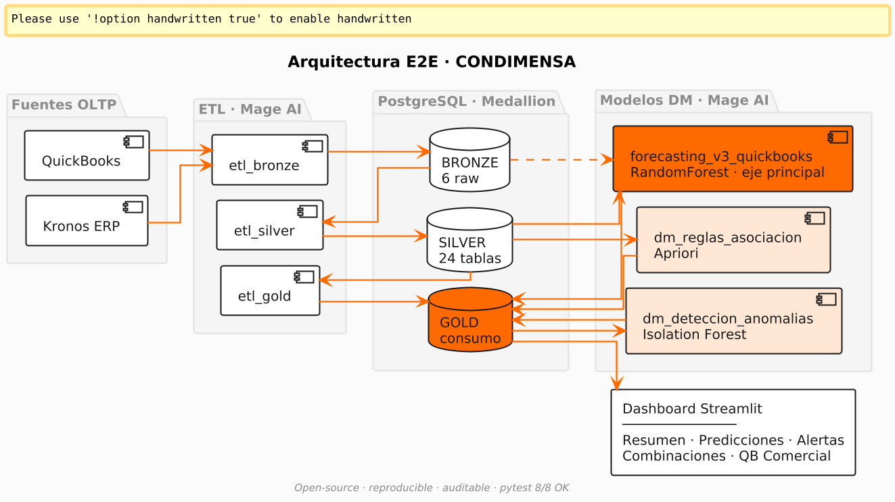
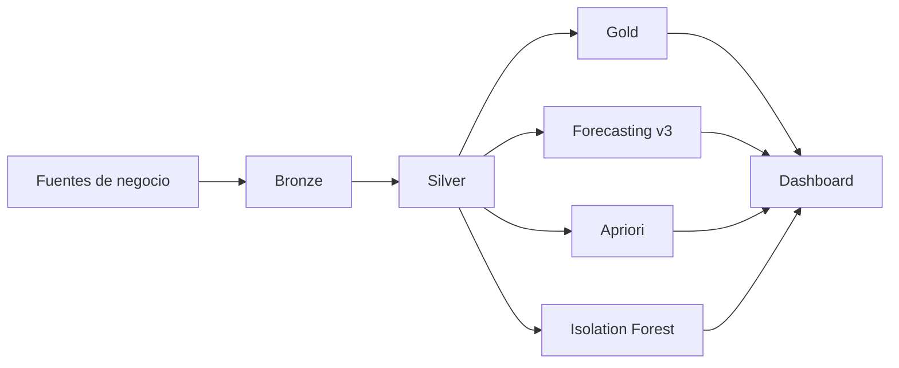
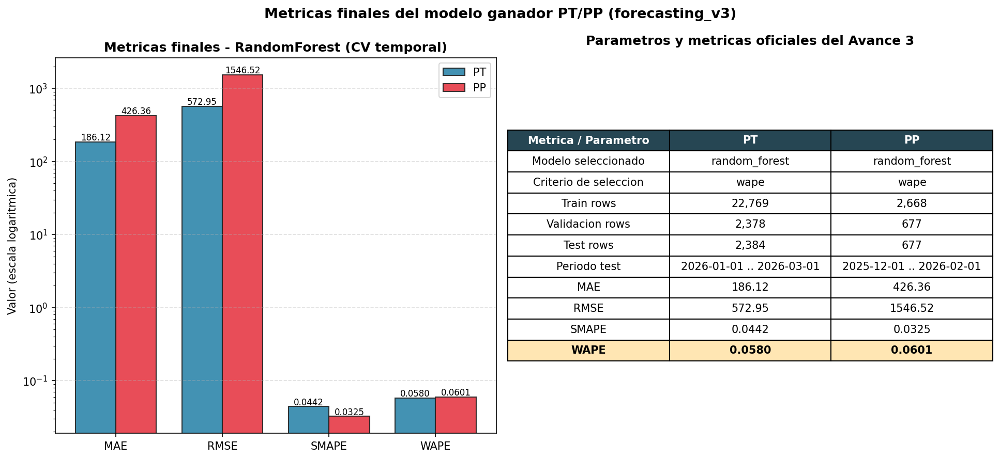
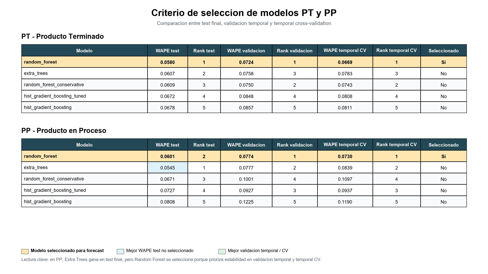
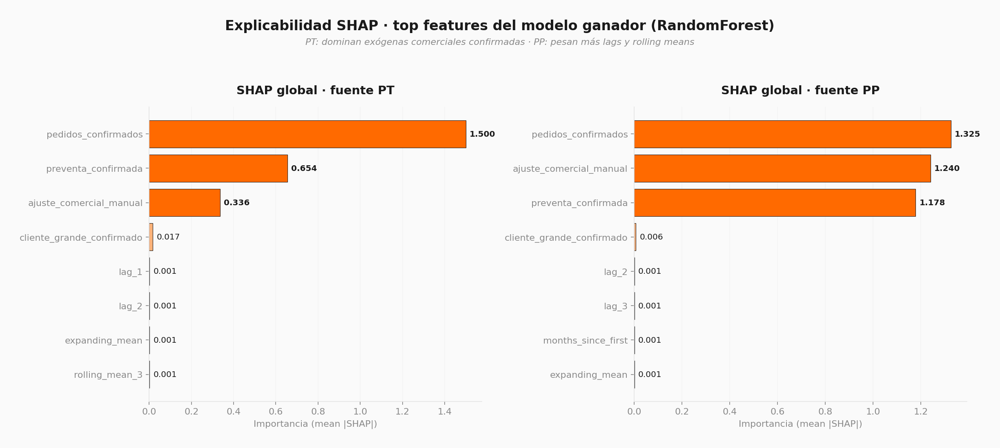
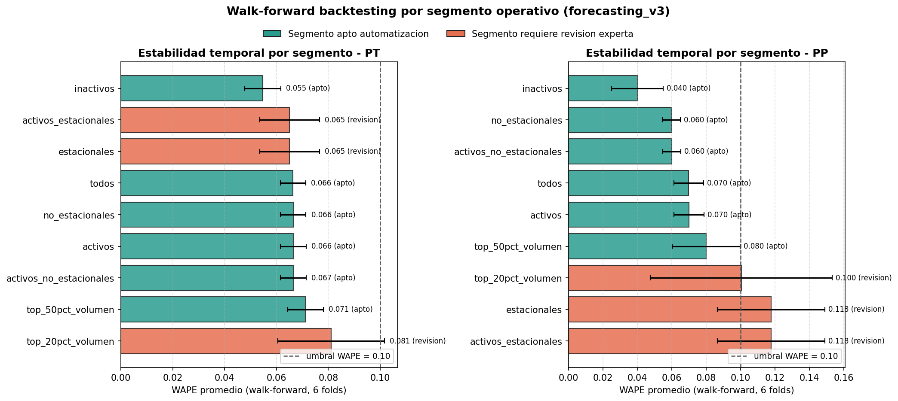
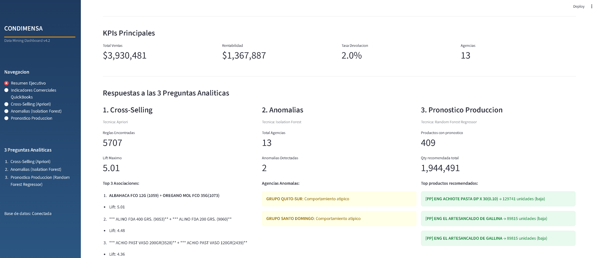
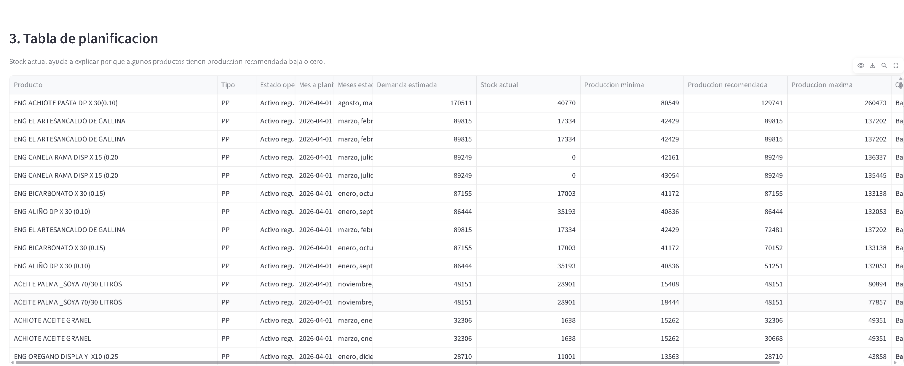

# Proyecto Integrador - Plataforma analitica y forecasting para CONDIMENSA

Este directorio contiene la version final del proyecto de tesis. La idea central
fue construir una solucion reproducible para integrar datos operativos,
transformarlos con arquitectura Medallion y convertirlos en analitica util para
negocio: dashboard, mineria de datos y forecasting de produccion.

## Que hay en esta carpeta

- `mage_condimensa2/`: implementacion aplicada de ETL, dashboard y pipelines en
  Mage AI.
- `Modelado/`: version final del forecasting documentada y lista para revisar.
- `docs/images/`: figuras y capturas tomadas de la tesis final y de la
  presentacion de sustentacion.

## Objetivo del proyecto

Resolver un problema operativo real: consolidar informacion dispersa de ventas,
produccion e inventario para apoyar decisiones de planificacion con trazabilidad
y menor carga manual.

La solucion final integra:

- refinamiento de datos en capas `Bronze / Silver / Gold`;
- dashboard de consumo para negocio;
- forecasting para productos terminados (`PT`) y productos/proceso (`PP`);
- modulos de anomalias y cross-selling como analitica complementaria.

## Resultados que conviene mirar primero

- `forecasting_v3`:
  - `PT`: `WAPE = 0.0580`
  - `PP`: `WAPE = 0.0601`
- modelo ganador:
  - `RandomForest`, seleccionado con validacion temporal, no con el test final
- controles metodologicos:
  - exogenas previas
  - CV temporal
  - walk-forward
  - test como auditoria

## Arquitectura general





## Como recorrer el proyecto

Si eres lector nuevo, esta es la ruta recomendada:

1. Lee este archivo para ubicar el alcance general.
2. Entra a [Modelado/README.md](Modelado/README.md) para ubicar la parte de
   modelado final.
3. Revisa [Modelado/forecasting_v3/README.md](Modelado/forecasting_v3/README.md)
   para ver la version final del forecasting.
4. Revisa [mage_condimensa2/README.md](mage_condimensa2/README.md) para entender
   como el modelado se conecta con ETL y dashboard.
5. Usa [docs/README.md](docs/README.md) para saber de donde sale cada imagen del
   repositorio.

## Componentes principales

### `mage_condimensa2`

Contiene la capa mas cercana a operacion:

- pipelines `etl_bronze`, `etl_silver` y `etl_gold`;
- pipeline `forecasting_v3_quickbooks`;
- pipelines de mineria de datos:
  - `dm_reglas_asociacion`
  - `dm_deteccion_anomalias`
- dashboard Streamlit para consumo de negocio.

Mas detalle en [mage_condimensa2/README.md](mage_condimensa2/README.md).

### `Modelado/forecasting_v3`

Es la version final del pipeline de pronostico. Ahi estan:

- construccion de datasets PT y PP;
- feature engineering temporal;
- exogenas controladas para evitar leakage;
- comparacion de modelos con CV temporal;
- backtesting walk-forward;
- interpretabilidad SHAP;
- reglas operativas y reportes.

Mas detalle en
[Modelado/forecasting_v3/README.md](Modelado/forecasting_v3/README.md).

## Evidencia visual

### Metricas finales del forecasting



### Seleccion del modelo



### SHAP global



### Walk-forward



### Dashboard y tabla de planificacion





## Tecnologias

### Datos e integracion

- Python
- PostgreSQL
- SQL
- Mage AI
- Supabase

### Machine Learning y analitica

- scikit-learn
- Random Forest
- SHAP
- Apriori
- Isolation Forest

### Visualizacion

- Streamlit
- Power BI

## Estructura resumida

```text
Avance Final/
|- mage_condimensa2/
|- Modelado/
|  |- forecasting_v3/
|- docs/
|  |- images/
|- README.md
```

## Que no incluye esta version publica

Para proteger informacion empresarial y mantener el repo portable, se excluyen:

- datasets crudos o sensibles;
- credenciales y configuraciones privadas;
- artefactos pesados de ejecucion;
- documentos firmados;
- artefactos temporales o de ejecucion local;
- archivos pesados generados en corridas internas y salidas temporales que pueden regenerarse.

## Autor

**Anthony Fajardo**  
Proyecto final de tesis - Ingenieria en Ciencias de la Computacion  
