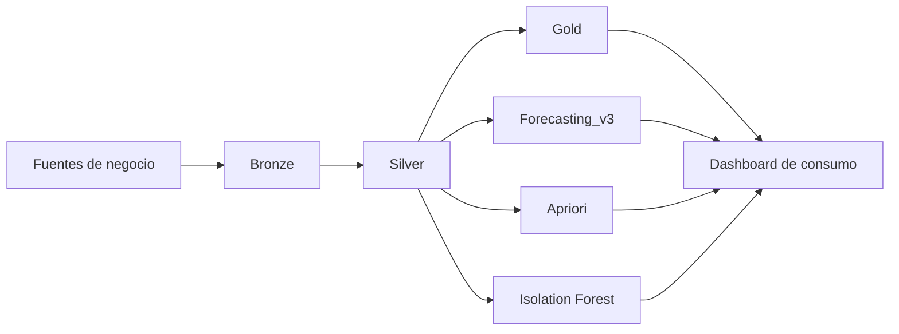

# Proyecto Integrador - Plataforma Analitica y Forecasting 

Proyecto final de tesis enfocado en integrar datos empresariales, construir una arquitectura analitica reproducible y desarrollar modelos de forecasting aplicados al caso real de CONDIMENSA.

La version publicada en este repositorio concentra el codigo y la documentacion tecnica mas relevante del proyecto final:

- pipelines ETL y dashboard en `Mage AI`;
- evolucion del modelado desde `forecasting_tesis_v2` hasta `forecasting_v3`;
- evidencia visual tomada de la tesis y de la presentacion final.

## Objetivo del proyecto

El proyecto busca resolver un problema comun en entornos operativos: la informacion se encuentra dispersa entre multiples fuentes, con procesos manuales para consolidar ventas, produccion e inventario, y con poca trazabilidad para apoyar decisiones de planificacion.

La solucion propuesta integra:

- refinamiento progresivo de datos con arquitectura `Bronze / Silver / Gold`;
- analitica operativa para consumo en dashboard;
- modelos de forecasting para productos terminados (`PT`) y productos/proceso (`PP`);
- tecnicas complementarias de mineria de datos para anomalias y cross-selling.

## Alcance de esta version publica

Esta version del proyecto fue depurada para publicacion academica y portafolio. Incluye principalmente:

- codigo fuente de ETL y transformaciones en `mage_condimensa2`;
- codigo, notebooks y configuracion de `Modelado/forecasting_tesis_v2` y `Modelado/forecasting_v3`;
- imagenes y figuras documentales en `docs/images`.

No incluye datos empresariales crudos, credenciales, artefactos pesados generados en ejecucion ni documentos sensibles firmados.

## Arquitectura general




## Componentes principales

### 1. `mage_condimensa2`

Contiene la capa aplicada de integracion y consumo operativo del proyecto:

- pipelines ETL en Mage AI;
- transformaciones para capas Bronze, Silver y Gold;
- pipelines de mineria de datos;
- dashboard para visualizacion y apoyo a decision.

Pipelines destacados dentro del proyecto:

- `etl_bronze`
- `etl_silver`
- `etl_gold`
- `forecasting_v3_quickbooks`
- `dm_reglas_asociacion`
- `dm_deteccion_anomalias`

### 2. `Modelado/forecasting_v3`

Contiene la version final del pipeline de pronostico desarrollado para la tesis, incluyendo:

- preparacion de datasets PT y PP;
- feature engineering temporal;
- control anti-leakage;
- validacion temporal;
- backtesting walk-forward;
- explicabilidad SHAP;
- generacion de reportes y reglas operativas.

El modelo ganador final fue `RandomForest`, seleccionado por `WAPE` mediante validacion temporal cruzada.

### 3. `Modelado/forecasting_tesis_v2`

Se conserva la version previa del modelado como referencia comparativa dentro del proceso de tesis.

Esto permite revisar:

- el enfoque anterior del forecasting;
- la comparacion metodologica entre `v2` y `v3`;
- la justificacion de la mejora final obtenida en `forecasting_v3`.

## Resultados principales

### Forecasting final

- **PT**: `WAPE = 0.0580`
- **PP**: `WAPE = 0.0601`

Estos resultados corresponden a la version final `forecasting_v3` presentada en la tesis y auditada con test final y evaluacion walk-forward.


### Seleccion del modelo

La seleccion del modelo no se realizo con el conjunto de test. Se empleo validacion temporal cruzada para comparar candidatos y luego el test final se mantuvo como auditoria.


### Explicabilidad

Se utilizo SHAP para interpretar el modelo ganador y entender que variables pesaban mas en las predicciones globales de PT y PP.


### Robustez temporal

Ademas del holdout final, se realizo evaluacion walk-forward para medir estabilidad temporal y soportar reglas de automatizacion parcial por segmento operativo.


## Dashboard y consumo operativo

El proyecto no termina en notebooks o scripts. Una parte importante del trabajo fue llevar la analitica a un formato consumible para negocio mediante dashboard y tablas de apoyo a la planificacion.


## Tecnologias utilizadas

### Datos e integracion

- Python
- PostgreSQL
- SQL
- Mage AI

### Machine Learning y analitica

- scikit-learn
- Random Forest
- SHAP
- Apriori
- Isolation Forest

### Visualizacion

- Streamlit
- Power BI

## Estructura del repositorio

```text
Avance Final/
- mage_condimensa2/          # ETL, pipelines Mage AI y dashboard
- Modelado/
  - forecasting_tesis_v2/    # Iteracion previa usada como referencia comparativa
  - forecasting_v3/          # Pipeline final de forecasting PT/PP
- docs/
  - images/                  # Figuras seleccionadas de tesis y presentacion
- README.md
```

## Como recorrer el proyecto

Si quieres revisar el proyecto rapidamente, esta es la mejor ruta:

1. Leer este `README.md` para entender el alcance general.
2. Revisar `Modelado/forecasting_tesis_v2` para entender el punto de partida del modelado.
3. Entrar a `Modelado/forecasting_v3` para revisar la version final del forecasting.
4. Revisar `mage_condimensa2` para ver la implementacion de ETL, pipelines y dashboard.
5. Revisar `docs/images` para ver las principales evidencias visuales de la solucion final.

## Nota sobre privacidad y publicacion

Este repositorio fue adaptado para publicacion academica y portafolio. Por esa razon se excluyeron:

- datasets crudos o sensibles;
- credenciales;
- documentos firmados;
- artefactos temporales o de ejecucion local;
- archivos pesados generados en corridas internas.

## Autor

**Anthony Fajardo**  
Proyecto final de tesis - Ingenieria en Ciencias de la Computacion  
